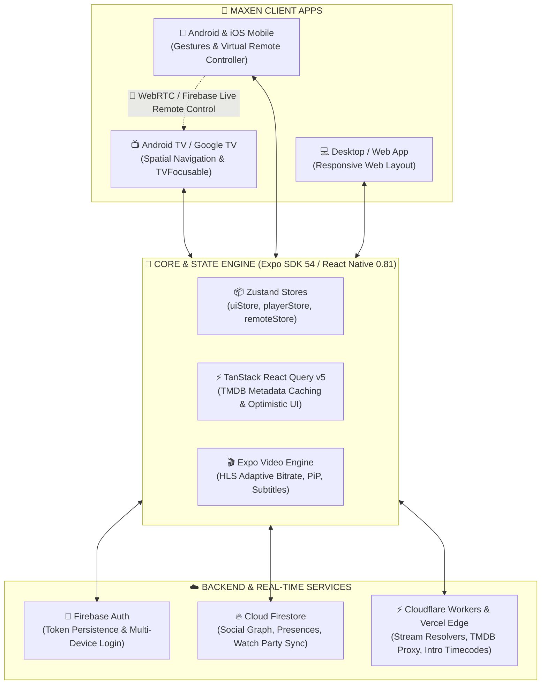

<div align="center">

  

  # 🎬 MAXEN
  ### Yeni Nesil Çapraz Platform Akıllı Medya, Sinema & Sosyal Yayın Ekosistemi
  
  **Android TV (Google TV) • Android Mobile • iOS • iPadOS • Masaüstü Web**

  <p align="center">
    
    
    
    
    
  </p>

  <p align="center">
    
    
    
    
    
  </p>

  <p align="center">
    <a href="https://skillicons.dev">
      
    </a>
  </p>

  <p align="center">
    <a href="#-genel-bakış"><b>Genel Bakış</b></a> •
    <a href="#-öne-çıkan-özellikler"><b>Özellikler</b></a> •
    <a href="#-desteklenen-platformlar"><b>Platformlar</b></a> •
    <a href="#-mimari-ve-teknoloji"><b>Mimari</b></a> •
    <a href="#-hızlı-başlangıç"><b>Hızlı Başlangıç</b></a> •
    <a href="#-tv-navigasyon-rehberi"><b>TV Rehberi</b></a> •
    <a href="#-yol-haritası"><b>Yol Haritası</b></a>
  </p>

</div>

---

## 📌 Genel Bakış

**Maxen**, modern streaming standartlarını (Netflix, Prime Video, Apple TV+) açık kaynaklı ve modüler bir mimariyle birleştiren gelişmiş bir medya ekosistemidir.

Yalnızca tek bir platforma odaklanmak yerine; **Android TV** oturma odası deneyiminden, **mobil** dikey Reels fragman keşfine, **web** üzerinden dev ekran deneyimine kadar tüm cihazları tek bir senkronize ağda buluşturur.

> [!IMPORTANT]
> **Öne Çıkan Fark:** Maxen'de telefonda izlediğiniz bir filmi TV'nize tek dokunuşla aktarabilir, telefonunuzu anında akıllı bir TV kumandasına dönüştürebilir ve arkadaşlarınızla mesafeler önemsizmiş gibi milisaniye senkronizasyonlu **Birlikte İzle (Watch Party)** odaları kurabilirsiniz.

---

## ✨ Öne Çıkan Özellikler

<table>
  <tr>
    <td width="50%">
      <h3>
        
        Gelişmiş Video Oynatıcı Motoru
      </h3>
      <ul>
        <li><b>Çoklu Motor Desteği:</b> Yerel HLS (m3u8), MP4, YouTube ve Vix akış çözümleyicileri.</li>
        <li><b>İntro & Jenerik Atlama:</b> Akıllı zamanlama tespitiyle tek tuşla dizi introsunu geçme.</li>
        <li><b>Player X-Ray:</b> Duraklatıldığında sahnede yer alan oyuncular, karakter isimleri ve yapım detayları.</li>
        <li><b>Kapsamlı Altyazı & Ses:</b> Boyut, kenarlık, renk, arka plan opaklığı ve çoklu dil seçici.</li>
        <li><b>Jest Kontrolleri:</b> Çift dokunma dalga efekti (Seek Ripple), dikey kaydırmalı ses ve parlaklık HUD'ı.</li>
        <li><b>Stats for Nerds:</b> Bitrate, kare düşmesi, çözünürlük ve arabellek sağlığı telemetrisi.</li>
      </ul>
    </td>
    <td width="50%">
      <h3>
        
        10-Foot Android TV & Leanback
      </h3>
      <ul>
        <li><b>D-Pad & Kumanda Optimizasyonu:</b> <code>TVFocusable</code> altyapısıyla kusursuz spatial odak takibi.</li>
        <li><b>Android TV Başlatıcı Entegrasyonu:</b> <code>withAndroidTV</code> eklentisiyle yerel TV bannerı ve Leanback desteği.</li>
        <li><b>Netflix Tarzı TVSidebar:</b> Kumanda yön tuşlarına duyarlı, akıcı genişleyen menü.</li>
        <li><b>QR Kod ile TV Oturumu Açma:</b> TV ekranındaki QR kodu telefondan okutarak anında şifresiz giriş.</li>
      </ul>
    </td>
  </tr>
  <tr>
    <td width="50%">
      <h3>
        
        Cihazlar Arası Süreklilik (Ecosystem)
      </h3>
      <ul>
        <li><b>Cross-Device Handoff:</b> Mobilde izlemeyi bıraktığınız an TV'de <i>"İzlemeye Devam Et"</i> bildirimi.</li>
        <li><b>Sanal TV Kumandası (Virtual Remote):</b> Telefonu dokunmatik D-Pad kumandaya dönüştürme.</li>
        <li><b>Canlı Klavye Senkronizasyonu:</b> TV'deki arama ve giriş kutularına telefondan doğrudan yazı yazma.</li>
        <li><b>TV'ye Yansıt (Play on TV):</b> Mobil veya webden tek tıkla TV'de video başlatma.</li>
      </ul>
    </td>
    <td width="50%">
      <h3>
        
        Sosyal Ağ & Birlikte İzle (Watch Party)
      </h3>
      <ul>
        <li><b>Canlı Oda Senkronizasyonu:</b> Firebase tabanlı mikro-saniye oynat/duraklat/sar eşzamanlaması.</li>
        <li><b>Oynatıcı İçi Canlı Sohbet:</b> Yan çekmecede gerçek zamanlı mesajlaşma ve reaksiyonlar.</li>
        <li><b>Canlı Durum (Live Presence):</b> Arkadaşlarınızın şu an ne izlediğini anlık görme.</li>
        <li><b>Sosyal Profil & DM:</b> Kullanıcı arama (@username), arkadaşlık istekleri ve özel mesajlaşma.</li>
      </ul>
    </td>
  </tr>
</table>

<details>
<summary><b>
  
  Reels Dikey Fragman Akışı & Detaylı Keşif (Genişletmek için tıklayın)
</b></summary>

<br />

* **Maxen Reels:** TikTok / Instagram tarzı akıcı, dikey kaydırılabilir, otomatik önizlemeli fragman akışı.
* **Kapsamlı TMDB Kataloğu:** Trendler, Popüler Filmler/Diziler, En Çok Oy Alanlar ve Türe Göre (Aksiyon, Komedi, Bilim Kurgu vb.) dinamik filtreler.
* **Oyuncu & Yapım Detayları:** Aktör/aktris biyografileri, fotoğrafları ve kronolojik filmografileri.
* **Çoklu Profil Yönetimi:** Aile üyeleri veya bireysel kullanım için bağımsız İzleme Listesi, İzleme Geçmişi ve Tercihler.
</details>

---

## 📱 Desteklenen Platformlar

| Platform | Uyumluluk Durumu | Kontrol / Giriş Yöntemi | Özel Donanım & Arayüz Desteği |
| :--- | :---: | :--- | :--- |
|  **Android TV / Google TV** | 🟢 **1. Sınıf Destek** | D-Pad / Kumanda | `TVFocusable`, Leanback Banner, QR Pair |
|  **Android Mobil & Tablet** | 🟢 **1. Sınıf Destek** | Dokunmatik / Jestler | Sanal Kumanda, Reels Feed, PiP, Handoff |
|  **iOS / iPadOS** | 🟢 **1. Sınıf Destek** | Dokunmatik / Jestler | Picture-in-Picture, Native Sheet Modals |
|  **Masaüstü & Web** | 🟢 **1. Sınıf Destek** | Klavye & Fare | Netflix-style Navbar, Geniş Ekran UI |

---

## 🏗️ Mimari ve Teknoloji



---

## 📂 Proje Dizin Yapısı

```bash
maxen/
├── android/                 # Android & Android TV yerel proje dosyaları (Gradle)
├── api/                     # Serverless / Edge API uç noktaları (stream, tmdb, intro)
├── assets/                  # Logolar, yazı tipleri, splash ve ikon setleri
├── src/
│   ├── app/                 # Expo Router v6 dosya tabanlı yönlendirme rotaları
│   ├── components/          # Paylaşılan atomik bileşenler (TVFocusable, Modallar)
│   ├── config/              # Firebase, TMDB, API istemcileri ve ortam ayarları
│   ├── constants/           # Tema renkleri, tipografi sabitleri
│   ├── contexts/            # Kimlik doğrulama bağlamı (AuthContext)
│   ├── features/
│   │   └── player/          # Video oynatıcı motoru, X-Ray, altyazı/ses menüleri
│   ├── hooks/               # Özel React kancaları (useTheme, useTVKeys, vb.)
│   ├── modules/             # Ses tanıma ve yerel hata kayıt modülleri
│   ├── services/            # Watch Party, Handoff, TV Remote, Sosyal Servisler
│   ├── store/               # Zustand küresel durum depoları
│   ├── styles/              # Global stiller ve tema paletleri
│   ├── types/               # TypeScript tip tanımları ve sözleşmeleri
│   └── views/               # Ana ekran görünümleri (Home, MediaHub, Reels, Social)
├── cloudflare-worker.js     # Edge stream proxy & resolver betiği
├── app.json                 # Expo proje ve plugin konfigürasyonu
├── withAndroidTV.js         # Android TV Leanback Expo Config Plugin
└── package.json             # Bağımlılıklar ve çalıştırma scriptleri
```

---

## 🚀 Hızlı Başlangıç

### 1. Ön Koşullar
*  [Node.js](https://nodejs.org/) (v18 veya üzeri önerilir)
*  [npm](https://www.npmjs.com/) veya [yarn](https://yarnpkg.com/)
*  [Expo CLI](https://docs.expo.dev/get-started/installation/) (`npm install -g expo-cli`)
*  Android geliştirme için [Android Studio](https://developer.android.com/studio) ve Android SDK

### 2. Kurulum Adımları

```bash
# 1. Depoyu klonlayın
git clone https://github.com/ahmeterdemserceoglu/maxen.git
cd maxen

# 2. Bağımlılıkları yükleyin
npm install
```

### 3. Ortam Değişkenlerini Yapılandırın

Kök dizinde `.env` dosyası oluşturun ve gerekli değerleri girin:

```env
# TMDB ve API Proxy Uç Noktası
EXPO_PUBLIC_API_URL=https://maxen.sbs

# Firebase Proje Konfigürasyonu
EXPO_PUBLIC_FIREBASE_API_KEY=AIzaSy...
EXPO_PUBLIC_FIREBASE_AUTH_DOMAIN=your-project.firebaseapp.com
EXPO_PUBLIC_FIREBASE_PROJECT_ID=your-project-id
EXPO_PUBLIC_FIREBASE_STORAGE_BUCKET=your-project.firebasestorage.app
EXPO_PUBLIC_FIREBASE_MESSAGING_SENDER_ID=1087681590566
EXPO_PUBLIC_FIREBASE_APP_ID=1:1087681590566:web:...
```

### 4. Uygulamayı Başlatın

```bash
# Metro geliştirici sunucusunu başlatın
npm start

# Android Cihaz / Emülatör / Android TV üzerinde çalıştırın
npm run android

# Web tarayıcısında çalıştırın
npm run web

# iOS Simülatöründe çalıştırın (macOS)
npm run ios
```

---

## 🎮 TV Navigasyon Rehberi

Maxen, televizyon ekranlarında kumanda ile kullanım için sıfırdan optimize edilmiştir:

```
                  ┌──────────────────────┐
                  │       ▲ [YUKARI]     │
                  │                      │
     ┌────────────┼──────────────────────┼────────────┐
     │ ◄ [SOL]    │   ● [OK / SEÇ / OYNAT│  ► [SAĞ]   │
     │ (Hızlı Menü│                      │            │
     └────────────┼──────────────────────┼────────────┘
                  │       ▼ [AŞAĞI]      │
                  └──────────────────────┘
                     [GERİ]      [MENÜ]
```

* **Yön Tuşları (D-Pad):** Odaklanan kart veya buton parlar ve otomatik olarak görünür alana kayar.
* **OK / Seç Butonu:** Detay sayfasını açar veya videoyu anında başlatır.
* **Geri (Back):** Bir önceki menüye döner; ana sayfadaysa çıkış onayı ister.
* **Sol Yön (En Solda):** Otomatik olarak Netflix tarzı genişleyen **TVSidebar** menüsünü açar.

---

## 🛠️ Kullanılan Teknolojiler & Kütüphaneler

| Kategori | Teknoloji | Açıklama |
| :--- | :--- | :--- |
| **Framework** |  [React Native 0.81.5](https://reactnative.dev/) & [Expo SDK 54](https://expo.dev/) | Yeni mimari ve performans iyileştirmeleri |
| **Dil** |  [TypeScript 5.3](https://www.typescriptlang.org/) | Tam tip güvenliği ve modüler sözleşmeler |
| **Yönlendirme** |  [Expo Router v6](https://docs.expo.dev/router/introduction/) | Dosya tabanlı tip güvenli rota yönetimi |
| **Durum Yönetimi** |  [Zustand](https://github.com/pmndrs/zustand) | Hafif, ölçeklenebilir UI ve Player durumları |
| **Veri Önbelleği** |  [TanStack React Query v5](https://tanstack.com/query) | Arka plan önbellekleme ve senkronizasyon |
| **Veritabanı / Auth** |  [Firebase Firestore & Auth](https://firebase.google.com/) | Canlı oda senkronu, arkadaşlık ve kimlik |
| **Video Oynatma** |  [expo-video](https://docs.expo.dev/versions/latest/sdk/video/) | Donanım hızlandırmalı modern video oynatıcı |
| **Edge / Proxy** |   Cloudflare & Vercel | Sunucusuz akış çözümleyici ve API proxy |

---

## 📦 Derleme ve Üretime Dağıtım (Production Build)

### 🤖 Android TV & Mobil APK Üretimi:

EAS (Expo Application Services) kullanarak bağımsız APK/AAB dosyaları üretebilirsiniz:

```bash
# Android için Production APK derleme
npx eas build -p android --profile production

# Android TV odaklı özel derleme profili
npx eas build -p android --profile production-tv
```

### 🌐 Web Statik Dışa Aktarımı:

```bash
# Web için optimize edilmiş statik bundle oluşturur
npm run build:web
```

---

## 🗺️ Yol Haritası (Roadmap)

- [x] Android TV D-Pad Odaklanma Sistemi (`TVFocusable`)
- [x] Sanal TV Kumandası & Canlı Klavye Senkronizasyonu
- [x] Gerçek Zamanlı Birlikte İzle (Watch Party)
- [x] Maxen Reels Fragman Akışı
- [x] Oyuncu Detayları & Filmografi Sayfaları
- [x] Cross-Device Playback Handoff
- [ ] Çevrimdışı İndirme & İzleme Modu (Offline Download)
- [ ] Çoklu Dil & Otomatik Çeviri Desteği (i18n)
- [ ] AI Destekli Kişiselleştirilmiş Dizi/Film Öneri Motoru

---

## 🤝 Katkıda Bulunma (Contributing)

Katkılarınız projeyi daha harika hale getirmemize yardımcı olur! 

1. Depoyu Fork'layın (`Fork`)
2. Özellik dalınızı oluşturun: `git checkout -b feature/harika-ozellik`
3. Değişikliklerinizi commit'leyin: `git commit -m 'feat: Yeni harika özellik eklendi'`
4. Dalınıza push yapın: `git push origin feature/harika-ozellik`
5. Bir **Pull Request** oluşturun.

---

## 📄 Lisans

Bu proje **MIT Lisansı** ile lisanslanmıştır. Ayrıntılı bilgi için [LICENSE](LICENSE) dosyasını inceleyebilirsiniz.

---

<div align="center">
  <p><b>Maxen</b> — Sinema deneyimini her ekrana taşıyın. 🍿</p>
  <sub>Geliştirici: <a href="https://github.com/ahmeterdemserceoglu">@ahmeterdemserceoglu</a> ve Topluluk Katkıcıları</sub>
</div>
